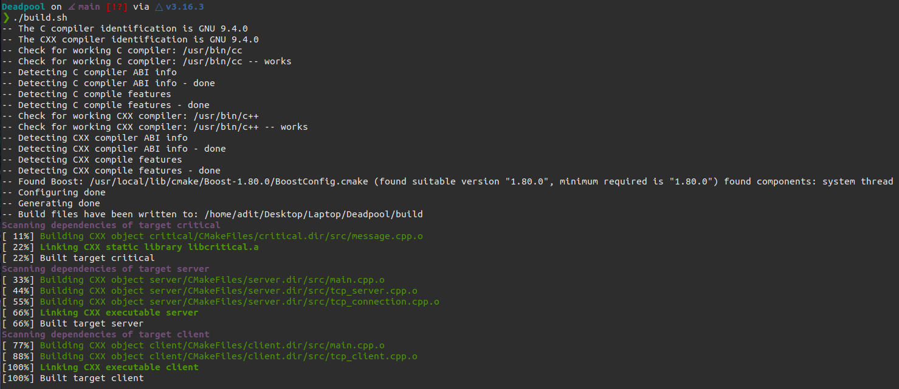

# Deadpool
Let's first answer the elephant in the room: Why did I name it **Deadpool**? Well, because he's my favourite Anti-Hero, although arguably, Loki is a close second.

## What is it?
As you should know, Deadpool is known as the "Merc with a mouth" and it would make sense for him to have his very own chat-app to talk to (\*cough\* *annoy* \*cough\*) people (\*cough\* *Wolverine* \*cough\*) if and when needed. Aaaaaand it needs to be fast, so I wrote it in C++. No other reason. Absolutely none. Not at all because I am in a C++ lunatic phase right now.

## How to use it?
- Dependancies
```sh
sudo apt install libboost-all-dev
```
- Clone
```sh
git clone git@github.com:Jadit19/Deadpool.git
cd Deadpool
```
- Build
```sh
chmod +x ./build.sh
```
At this point, something like this should be visible on your screen (if not, open up an issue):


- Run server
```sh
./build/server/server
```
- Run client(s)
```sh
./build/client/client
```

## How to exit?
Unlike Vim, this can be exited pretty cleanly:
- `\q` to just quit.
- `\sq` to save and quit.

## Todo
- [ ] User Guide
- [x] JSON communication
- [ ] GUI input/output
- [ ] Static IP allocation
- [ ] TCP v6 support